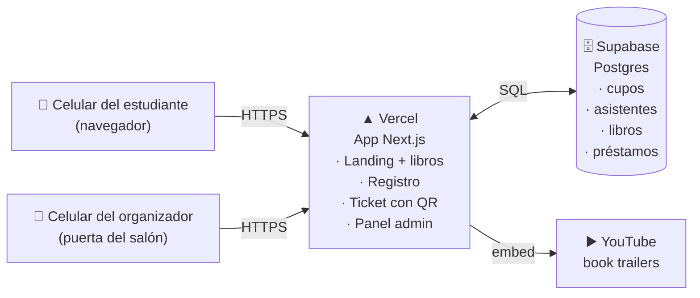
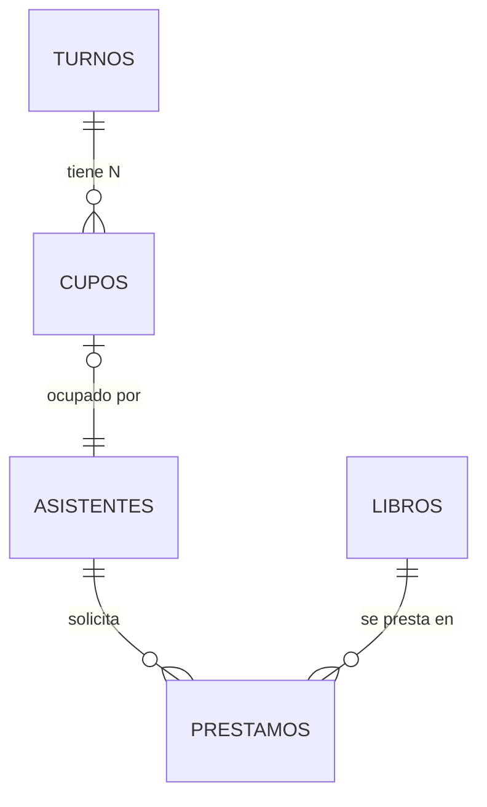
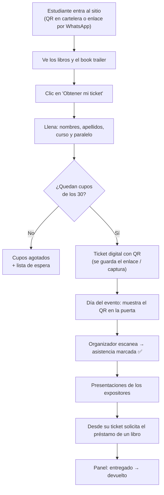

# EduTicket — Plan de implementación

**Proyecto interdisciplinario · Zona Literaria (salón de música)**
Sistema de tickets digitales para controlar el aforo de la Zona Literaria y gestionar el préstamo de libros.

> 📅 **Evento: viernes 16 de octubre de 2026** · Aforo: **30 personas, turno único** · Cursos: 8vo, 9no y 10mo

Documento vivo: versión 2 · 20 de septiembre de 2026

---

## 1. Resumen del proyecto

Los estudiantes montan una **Zona Literaria** en el salón de música el **viernes 16 de octubre de 2026**. Cada expositor ambienta un espacio según su obra y la presenta. El salón tiene **aforo limitado: 30 personas en un turno único**, así que el acceso se controla con un **ticket digital** que el asistente obtiene desde una página web. Al terminar la jornada, quien quiera puede **solicitar el préstamo del libro** que le interesó.

### Qué tiene que resolver el sitio

| # | Necesidad | Cómo se resuelve |
|---|-----------|------------------|
| 1 | Registro del asistente (nombre, apellidos, curso) | Formulario público, sin contraseñas |
| 2 | Aforo máximo de 30 respetado | 30 cupos numerados en base de datos; cuando se agotan, el sitio lo dice |
| 3 | Ticket para entrar | Código único + QR, visible en el celular o impreso |
| 4 | Lista de quién asistió | Panel de administración + exportar a Excel/CSV |
| 5 | Control de préstamos | Solicitud desde el ticket; el panel marca entregado / devuelto |
| 6 | Book trailer | Video embebido en la portada y en cada ficha de libro |
| 7 | Vitrina de los libros | Ficha con portada, sinopsis y expositor |

### Alcance (lo que SÍ y lo que NO)

**Sí:** un evento (16/10/2026), 3 libros, 30 asistentes, uso desde celular, gratis.
**No (por ahora):** pagos, cuentas con contraseña, notificaciones por correo/WhatsApp, app móvil nativa, multi-colegio.

---

## 2. Los libros (contenido inicial)

| Libro | Autor / edición | Expositor | Portada | Estado |
|-------|-----------------|-----------|---------|--------|
| Veinte mil leguas de viaje submarino | Jules Verne — Austral | *(por definir)* | `public/portadas/veinte-mil-leguas.jpg` ✅ | Lista |
| El Hobbit | J.R.R. Tolkien — Minotauro (portada de Smaug) | *(por definir)* | `public/portadas/el-hobbit.jpg` ✅ | Lista |
| Enciclopedia de dinosaurios | *(por confirmar edición)* | *(por definir)* | *(falta)* | Pendiente |

> El catálogo vive en la base de datos, así que **agregar o cambiar libros no requiere tocar el código**: se edita desde el panel o desde la tabla de Supabase.

**Pendiente del equipo:** portada de la enciclopedia de dinosaurios (foto del ejemplar real sirve), sinopsis de 3–4 líneas por libro, nombre del expositor, cuántos ejemplares hay disponibles para préstamo y el enlace del book trailer.

---

## 3. Arquitectura recomendada

### Decisión

> **Una sola aplicación Next.js desplegada en Vercel, con base de datos Postgres en Supabase.** Todo en el plan gratuito.



### Por qué esta y no otra

| Opción | Ventaja | Por qué NO la elegimos |
|--------|---------|------------------------|
| **Next.js + Supabase en Vercel** ✅ | Un solo proyecto, el control de aforo se hace en el servidor (seguro), despliegue automático desde GitHub, gratis | — |
| HTML/CSS/JS puro + Google Forms | Súper simple | No hay ticket ni QR, no se puede frenar el aforo automáticamente, se ve genérico |
| Sitio estático + Google Sheets (Apps Script) | El profesor ve la lista en una hoja de cálculo | Frágil, problemas de CORS, dos personas pueden tomar el último cupo a la vez |
| Backend aparte (Express/Flask) + frontend aparte | "Más profesional" | Dos despliegues, dos dominios, CORS, el doble de trabajo para el mismo resultado |
| Firebase | Tiempo real | La lógica de aforo queda en el cliente o en funciones extra; más conceptos nuevos que aprender |

La ventaja de Sheets (que el profesor vea la lista) la recuperamos con un **botón de exportar a CSV** que se abre en Excel o Google Sheets.

### Stack

| Capa | Herramienta | Nota |
|------|-------------|------|
| Framework | **Next.js 15** (App Router, Server Actions) | Front y back en el mismo proyecto |
| Lenguaje | TypeScript | |
| Estilos | Tailwind CSS v4 | Rápido y responsivo desde el celular |
| Base de datos | **Supabase** (Postgres gratis) | Tiene editor de tablas visual |
| Acceso a datos | `@supabase/supabase-js` desde el servidor (service key) | El navegador nunca habla directo con la BD |
| QR | `qrcode` (generar) + `html5-qrcode` (escanear en la puerta) | |
| Despliegue | **Vercel** (Hobby, gratis) | `git push` = sitio actualizado |
| Código | GitHub (repo del equipo) | |

### Regla de oro de seguridad

Todo lo que decide algo importante —dar un cupo, marcar asistencia, aprobar un préstamo— pasa por el **servidor** (Server Actions / Route Handlers). El navegador solo muestra. Así nadie se auto-genera un ticket desde la consola del navegador.

---

## 4. Modelo de datos



| Tabla | Campos principales | Para qué |
|-------|--------------------|----------|
| `turnos` | `id`, `nombre` ("Zona Literaria – 16/10/2026"), `inicia_en`, `aforo`, `activo` | Arranca con **un solo turno de aforo 30**. La tabla existe igual para poder abrir un segundo turno sin tocar código si la demanda lo pide |
| `cupos` | `id`, `turno_id`, `numero`, `ocupado` | **Se crean los 30 cupos por adelantado**; registrarse = tomar uno |
| `asistentes` | `id`, `nombres`, `apellidos`, `curso` (8vo/9no/10mo), `paralelo`, `cupo_id`, `codigo_ticket`, `creado_en`, `ingreso_en` | La lista de asistencia |
| `libros` | `id`, `slug`, `titulo`, `autor`, `sinopsis`, `portada_url`, `trailer_url`, `expositor`, `ejemplares` | Catálogo editable |
| `prestamos` | `id`, `asistente_id`, `libro_id`, `estado` (solicitado / entregado / devuelto), `solicitado_en`, `entregado_en`, `devuelto_en` | Control del préstamo |

### Cómo se garantiza que no se pase del aforo

En vez de "contar cuántos hay y comparar" (que falla si dos personas envían el formulario en el mismo segundo), se **reclama un cupo ya existente** con una sola consulta atómica:

```sql
UPDATE cupos SET ocupado = true
WHERE id = (
  SELECT id FROM cupos
  WHERE turno_id = $1 AND ocupado = false
  ORDER BY numero
  LIMIT 1
  FOR UPDATE SKIP LOCKED   -- el candado impide que dos tomen el mismo
)
RETURNING id, numero;
```

Si no devuelve nada, los 30 cupos están tomados y el sitio muestra "Cupos agotados" con la opción de anotarse en una lista de espera (por si alguien cancela o se abre un segundo turno).

### Evitar registros duplicados

Índice único sobre `(lower(nombres), lower(apellidos), curso, turno_id)`. Si alguien se registra dos veces, el sitio le devuelve **su mismo ticket** en vez de crear otro.

### Formato del ticket

`ET-9B-014` → `ET` (EduTicket) + curso/paralelo + número de cupo. Corto, legible en voz alta y fácil de buscar a mano si falla el escáner.
El QR codifica la URL `https://eduticket.vercel.app/t/ET-9B-014`, así cualquier cámara de celular lo abre sin app extra.

---

## 5. Recorrido del usuario



### Mapa de páginas

| Ruta | Quién la usa | Contenido |
|------|--------------|-----------|
| `/` | Todos | Portada: qué es la Zona Literaria, **viernes 16 de octubre**, lugar, **book trailer principal**, los 3 libros, contador "quedan N de 30 cupos", botón "Obtener mi ticket" |
| `/libros/[slug]` | Todos | Ficha del libro: portada, sinopsis, expositor, su book trailer |
| `/registro` | Asistente | Formulario (nombres, apellidos, curso, paralelo) |
| `/t/[codigo]` | Asistente | **Ticket digital**: QR, nombre, curso, fecha/hora, número de cupo (ej. 14 de 30), botón imprimir y botón "Quiero que me presten un libro" |
| `/admin` | Equipo organizador | Ingreso con PIN |
| `/admin/asistentes` | Equipo | Lista, buscador, ocupación por turno, exportar CSV |
| `/admin/puerta` | Puerta del salón | Escáner QR + búsqueda por nombre + marcar ingreso manual |
| `/admin/prestamos` | Equipo | Solicitudes, marcar entregado / devuelto, qué libro tiene quién |
| `/admin/libros` | Equipo | Crear y editar libros sin tocar código |

**Acceso del panel:** un PIN guardado como variable de entorno en Vercel (`ADMIN_PIN`), que crea una cookie firmada. Suficiente y proporcional para un evento escolar; no hay datos sensibles y así nadie tiene que administrar usuarios.

---

## 6. Book trailer

- **Producción:** CapCut o Canva (plantilla de video vertical o 16:9), 45–90 segundos, con voz o música sin copyright.
- **Alojamiento:** subirlo a **YouTube como "No listado"** (no aparece en búsquedas, pero cualquiera con el enlace lo ve). No subir archivos MP4 al repositorio: pesan y hacen lento el sitio.
- **En el sitio:** se embebe con una *fachada* (imagen de portada + botón ▶ que recién ahí carga YouTube). Así la página abre rápido aunque el WiFi del colegio esté lento.
- **Cuántos:** uno general del evento en la portada + uno por libro en su ficha (`trailer_url`). Si solo alcanzan a hacer uno, el sitio funciona igual.

---

## 7. Manejo de datos de estudiantes

El proyecto recoge datos de **menores de edad**, así que:

- Se pide **lo mínimo**: nombres, apellidos, curso y paralelo. Sin cédula, sin dirección, sin foto. Correo o teléfono: **opcional** y solo si el profesor lo pide para el préstamo.
- La lista de asistentes **nunca es pública**: solo se ve desde el panel con PIN.
- El ticket muestra el nombre de quien lo abre, pero su URL tiene un código no adivinable.
- Un aviso corto en el formulario: *"Usamos tus datos únicamente para el control de aforo y el préstamo de libros de esta actividad."*
- **Después del evento y de devueltos los libros**, se exporta la lista para el informe del proyecto y se borran los datos de la base.

---

## 8. Despliegue

### Recomendación: Vercel (gratis)

1. Se sube el código a un repositorio de GitHub del equipo.
2. Se conecta ese repo a Vercel → cada `git push` publica el sitio solo.
3. URL pública: `https://eduticket.vercel.app` (o el nombre que esté libre). HTTPS y certificado incluidos.
4. Se imprime un **QR de esa URL** para pegar en carteleras, y se comparte el enlace por WhatsApp.

### Costos

| Servicio | Plan | Costo | Alcanza para |
|----------|------|-------|--------------|
| Vercel Hobby | Gratis | $0 | Muchísimo más que 30 visitas |
| Supabase Free | Gratis | $0 | 500 MB de BD; usaremos < 1 MB |
| YouTube | Gratis | $0 | Los trailers |
| Dominio propio (opcional) | `.com` ≈ $12/año | Opcional | Solo si el colegio quiere marca propia |
| **Total** | | **$0** | |

### ⚠️ Dos avisos importantes

1. **Supabase pausa los proyectos gratuitos tras ~1 semana sin actividad.** Si el sitio queda quieto y llega el día del evento, la base podría estar dormida. Solución: un *cron* semanal (GitHub Actions o Vercel Cron) que haga una consulta trivial. Alternativa: usar **Neon**, que despierta solo. Se decide al configurar.
2. **El WiFi del colegio puede fallar.** El día del evento hay que llevar un **plan B impreso**: lista de asistentes en papel (exportada la noche anterior) y tickets que se puedan validar por código a mano. El panel de puerta permite buscar por nombre sin escáner.

### Variables de entorno

| Variable | Para qué |
|----------|----------|
| `NEXT_PUBLIC_SUPABASE_URL` | Conexión a la BD |
| `SUPABASE_SERVICE_ROLE_KEY` | Clave del servidor — **nunca** se sube a GitHub |
| `ADMIN_PIN` | Ingreso al panel |
| `NEXT_PUBLIC_SITE_URL` | Para armar la URL dentro del QR |

---

## 9. Fases de trabajo

> **Cómo versionamos:** al cerrar cada fase se dejan los cambios en *staged* y se hace **un commit por fase**, para que el historial cuente la evolución del proyecto en la exposición.

### Cronograma (evento: viernes 16 de octubre de 2026)

| Fase | Fechas | Hito |
|------|--------|------|
| 0 · Definiciones | 20 – 23 sep | Datos de los libros cerrados |
| 1 · Base técnica | 24 – 27 sep | Sitio desplegado y base de datos creada |
| 2 · Flujo del asistente | 28 sep – 4 oct | **Se pueden emitir tickets reales** |
| 3 · Panel del equipo | 5 – 10 oct | Control de puerta y préstamos listos |
| 4 · Pulido y ensayo | 11 – 15 oct | Simulacro el martes 13; congelar cambios el jueves 15 |
| 🎉 **Evento** | **viernes 16 oct** | Zona Literaria |
| 5 · Cierre | 17 – 24 oct | Devoluciones, informe y borrado de datos |

### Fase 0 — Definiciones del equipo (antes de programar)
- [x] Fecha del evento: **viernes 16 de octubre de 2026**
- [x] Aforo: **30 personas, turno único**
- [x] Portadas de *Veinte mil leguas* y *El Hobbit*
- [ ] Hora de inicio y duración de la jornada
- [ ] Expositor asignado a cada libro
- [ ] Portada de la enciclopedia de dinosaurios
- [ ] Sinopsis (3–4 líneas) de cada libro
- [ ] Ejemplares disponibles para préstamo por libro y plazo de devolución
- [x] Colores / identidad visual de EduTicket → **"Biblioteca nocturna"**, ver [DESIGN.md](DESIGN.md)

### Fase 1 — Base técnica
- [x] Crear proyecto Next.js 16 + React 19 + TypeScript + Tailwind 4
- [x] Sistema de diseño en `app/globals.css` (paleta, tipografías, animaciones)
- [x] Portada funcionando: hero, cuenta regresiva, catálogo, sección de trailer
- [x] SQL del esquema y datos iniciales (`db/01_schema.sql`, `db/02_seed.sql`)
- [x] Cliente de Supabase para el servidor (`lib/supabase.ts`)
- [x] README con instrucciones de instalación y despliegue
- [ ] **(equipo)** Crear el proyecto en Supabase y ejecutar los dos SQL
- [ ] **(equipo)** Repositorio en GitHub y conexión con Vercel

### Fase 2 — Flujo del asistente
- [ ] Portada con los libros y el trailer
- [ ] Fichas de libro
- [ ] Formulario de registro con validaciones
- [ ] Reclamo atómico de cupo + manejo de "agotado" (lista de espera) y de duplicados
- [ ] Página del ticket con QR, versión imprimible y buen diseño en celular

### Fase 3 — Panel del equipo
- [ ] Ingreso con PIN
- [ ] Lista de asistentes con buscador y exportar CSV
- [ ] Pantalla de puerta: escanear QR y marcar ingreso
- [ ] Gestión de préstamos (solicitado → entregado → devuelto)
- [ ] Editor de libros

### Fase 4 — Pulido y ensayo
- [ ] Revisar en celulares reales (Android y iPhone)
- [ ] Textos, ortografía y accesibilidad (contraste, tamaño de texto)
- [ ] **Simulacro completo:** 5 personas se registran, entran y piden un libro
- [ ] Imprimir QR de difusión y la lista de respaldo
- [ ] Dejar el sitio y la BD listos y "despiertos" el día previo

### Fase 5 — Después del evento
- [ ] Exportar datos para el informe del proyecto
- [ ] Cerrar los préstamos pendientes
- [ ] Borrar los datos personales de la base
- [ ] Capturas y métricas (cuántos asistieron, cuántos libros se prestaron) para la exposición

---

## 10. Roles sugeridos del equipo

| Rol | Responsabilidad |
|-----|-----------------|
| Contenido | Sinopsis, portadas, textos del sitio, datos de expositores |
| Book trailer | Guion, grabación, edición, subida a YouTube |
| Desarrollo | Implementación del sitio |
| Difusión | QR impresos, mensajes de WhatsApp, anuncio en cursos |
| Puerta (día del evento) | Escanear tickets y controlar el aforo |
| Préstamos | Entregar libros, registrar y hacer seguimiento a las devoluciones |

---

## 11. Riesgos y respaldos

| Riesgo | Plan B |
|--------|--------|
| No hay internet en el salón | Lista impresa la noche anterior + validación por código a mano |
| Base de datos pausada por inactividad | Cron semanal; **verificar el miércoles 14 de octubre** que todo responde |
| Alguien llega sin ticket y hay cupo libre | El panel de puerta permite registrar en el momento |
| Más de 30 interesados | Lista de espera + abrir un segundo turno (es solo crear una fila y sus cupos) |
| Libro prestado que no vuelve | El préstamo queda registrado con nombre y curso; recordatorio desde el panel |
| El trailer no está listo a tiempo | La página funciona sin él; se agrega después sin redesplegar nada |

---

## 12. Siguiente paso

**Fase 1 en marcha.** Lo que falta de la Fase 0 (expositores, sinopsis, portada de dinosaurios) no bloquea: son datos que se cargan después desde el panel.
